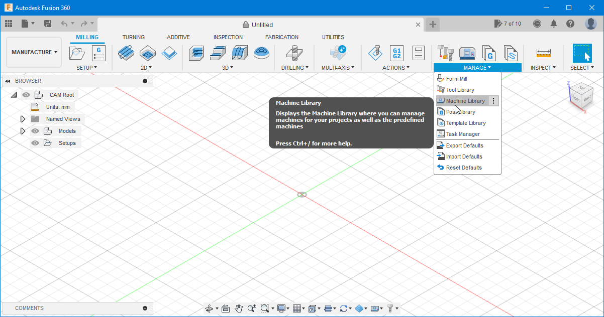
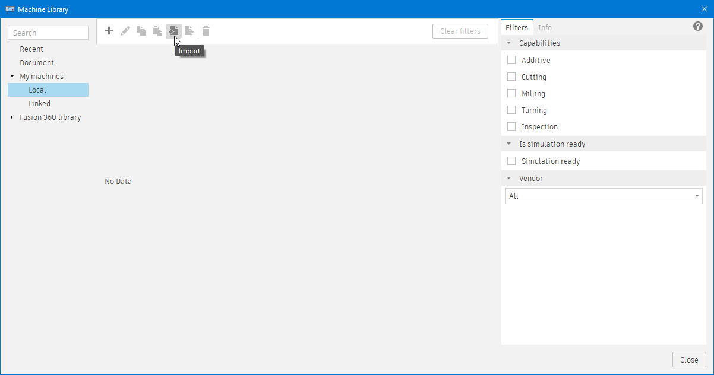

# Machine Library  

Here you can find a machine library for Snapmaker machines. If more machines are added, you will find them here.

Select any of the *.machine* files above for download, and refer to the instructions below on how to add them if you need.

# How to Install a Machine in Fusion 360

1. To install a machine in Fusion 360, you need first to change to the *Manufacture* workspace as on the image below.

    

2. Then, from the *Manage* section on the ribbon, select *Machine Library*.

    

3. On the *Machine Library* click on *Local* and then on the *Import* button.

    

4. From the window that opens, click on *Select from my computer...*

    

5. Browse to the location where you have downloaded the *.machine* file and open it. The machine is now shown on the window.

6. Repeat steps 3-5 to add any *.machine* files you may need and then you should have all the machines listed as on the next image.

    

7. You have now completed the machine installation. Please proceed to the instalation of the [*Post-Processor*](../Post-Processor).

######

These instructions were written for Fusion 360 version 2.0.12392 (2022, February)
