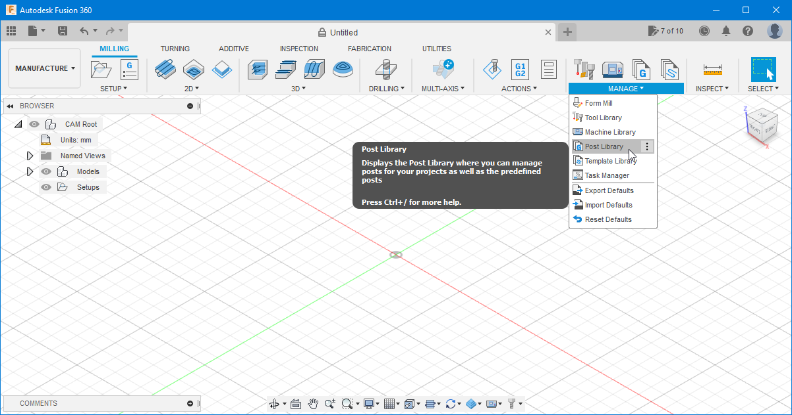

# Post Processor  

Here you can find available post-processors for the Snapmaker 2.0. If more post-processors are added, you will find them here.

The main post-processor - **SM2.0 (NrvO).cps** - contains several improvements and functionalities that are not present on the original Snapmaker post-processor file.

At the end of this page, after the list of improvements and functionalities, there is a tutorial on how to install a post-processor. [Go there now!](#how-to-install-a-post-processor-in-fusion-360)

## Improvements and Functionalities

Here we will try to go through all of them with the needed explanations to go along.

- ### Return to work origin at the end

    On the end of every CNC program, the original Snapmaker post-processor makes the tool head travel to the work origin in a straight line.  
    Depending on the location of the last tool position, there is a chance that the tool can colide with the work piece or with the clamps.

    The code on the second line below from the Snapmaker 2.0 *post-processor* is responsible for that:

    ```javascript
    function onClose() {
      writeBlock(gFormat.format(0), xOutput.format(0), yOutput.format(0));  // @TODO return to the origin
      writeBlock(mFormat.format(5));
    }
    ```

    On **SM2.0 (NrvO).cps**, this is fixed.

- ### Spindle Speed

    The Snapmaker post-processor does not support spindle speed and forces the spindle speed to 100% (12.000rpm on Snapmaker 2.0) on every CNC program.
    
    On **SM2.0 (NrvO).cps** the spindle speed can be selected in Fusion 360 tool path options. The spindle speed needs to be between 3.000rpm and 12.000rpm, and if it's outside of this values, it will be clamped to the minimum or maximum value in the range.
    
    On the top of **SM2.0 (NrvO).cps** there is a section with user configurable parameters where the variables ***MIN_SPINDLE_SPEED*** and ***MAX_SPINDLE_SPEED*** can be adjusted. Please note that the lower the spindle speed, the lower the torque to a point where it gets almost unusable.
    
    
    ```javascript
    {                                                              // User configuration. Please change only these values on this file
	    MIN_SPINDLE_SPEED                  = "3000";               // Minimum spindle speed. The lower it gets the less torque. 600 is possible but useless...
	    MAX_SPINDLE_SPEED                  = "12000";              // Maximum spindle speed. On Snapmaker 2.0 this is 12000rpm
	    DWELL_TIME_SPIN_UP                 = "2";                  // Dwell time for spin up in seconds. Used immediately after spindle start
	    DWELL_TIME_SPIN_DOWN               = "3";                  // Dwell time for spin down in seconds. Used immediately after spindle stop
    }
    ```

- ### Rapid Feed Rate Control

    When using Fusion 360, the feedrate of rapid moves match the feedrate of cutting moves.
    
    On **SM2.0 (NrvO).cps** there is an option that allow us to use a custom *feed rate* on travels. As an alternative, we can also force the replace the G1 command with a G0 command and ignore the *feed rate*.

    This will be useful when (hopefully in a near future) the *Laser Mode* is implemented to allow the Snapmaker laser module to be controlled by the same Fusion 360 toolpath, allowing for non-planar engravings.

- ### Fusion 360 Information Message

    When using Fusion 360 for Personal Use, there is an informative message added as a comment to the CNC file.
    
    On **SM2.0 (NrvO).cps** this message is not added to the CNC file to keepit as clean and readable as possible.

- ### Custom *Feed Rate* Option

    Following the above feature, and to allow an easy way to select a custom *feed rate* for the rapid moves across all toolpaths, a property has been added to the post-processor window to allow the user to select the desired value directly in Fusion 360 just before post-processing. This value will apply to all toolpaths being *post-processed* regardless of the values selected in each individual toolpath.

- ### Properties UI Improvements

    To make a better user interface, the custom properties have been upgraded to a programming object. This change allows **SM2.0 (NrvO).cps** to display proper properties names and tooltips that popup when hovered with the mouse, displayig additional information and a description for each property.

- ### Post-Processor Information

    An option to write a comment on the CNC file with information about the post-processor was added.
    
    This may be usefull to compare the output of different post-processor versions and understand the contrast between them.

- ### Extra Comments

    A new option was added to allow the user to have additional comments written to the CNC file. This allows for better understanding of the program execution as all operation have a descriptive comment.

- ### M400 Command

    At the end of every CNC program, before stopping the spindle, an M400 command was added following the recommendation from Snapmaker on the [G-code Reference](https://snapmaker.github.io/Documentation/gcode/M400).
    
    This makes sure to wait for moves to finish before turning off the spindle.

- ### Start and Stop *Dwell*

    In order to allow the spindle to be at desired speed before starting the CNC operation, a *dwell* (a pause) is added imediatelly after the instruction to turn the spindle on. This *dwell* is of 2 seconds.
    
    In the same way, when the spindle is stopped at the end of the CNC program, another *dwell* is added to let the spindle spin down before proceeding.
    
    Both this values are changeable on the post-processor file, on the section shown below, and by default are 2 seconds for spin up, and 3 seconds for spin down.
    
    ```javascript
    {                                                              // User configuration. Please change only these values on this file
	    MIN_SPINDLE_SPEED                  = "3000";               // Minimum spindle speed. The lower it gets the less torque. 600 is possible but useless...
	    MAX_SPINDLE_SPEED                  = "12000";              // Maximum spindle speed. On Snapmaker 2.0 this is 12000rpm
	    DWELL_TIME_SPIN_UP                 = "2";                  // Dwell time for spin up in seconds. Used immediately after spindle start
	    DWELL_TIME_SPIN_DOWN               = "3";                  // Dwell time for spin down in seconds. Used immediately after spindle stop
    }
    ```

- ### CC and CCW Rotation Support Added

   To allow for a bigger range of tools, support for both CC and CCW rotation was implemented. User can select the rotation diretion of each tool in Fusion 360 and this is is implememted on the post processor and passed on correctly to the machine. This is currently not supported by Snapmaker \(at least on A350, but is already implemented for  futureproof)

- ### Comments for Program Information and Operation Name

    New options added to allow the user to have CNC program information and CNC operation name added to the output CNC file as a comment.

- ### Added Support for Manual NC Commands

    In Fusion 360 there is an option to add manual NC commands. Snapmaker post-processor does not support this functionality but **SM2.0 (NrvO).cps** does implement this feature.
    Currently, the manual commands supported are as follow:
    
    | Command Type | Action Text | Description !
    | ----------- | ----------- | ----------- |
    | Action | ACTION_PAUSE | Pause the spindle and resume after user confirmation |
    | Action | ACTION_PAUSE_RAISE_Z | Pause the spindle, raise Z, and resume after user confirmation |

- ### Move Z-Axis Up on Start

    When starting the CNC program, there is a chance that the tool is below the starting work height, for example, if the user did set the work origin at z=0mm. In such cases, the Snapmaker post-processor sends the tool head to the starting point in a straight line. This is quite dangerous as it may hit the work piece or some clamps with possible dabages to the work piece, the tool or the machine.
    
    On **SM2.0 (NrvO).cps**, at the start of the CNC program, the movement is split. First the tool raises to the safe Z height, and only then the tool is moved in X-axis and Y-axis.

<sub>Improvements and Functionalities description last updated on March 21</sub><sup>st</sup><sub>, 2022</sub>

# How to Install a Post-Processor in Fusion 360

1. Following the installation of the machine, you are now ready to install a *post-processor*. To do so, on the *Machine Library* window ([How to Install a Machine in Fusion 360](../Machine%20Library#how-to-install-a-machine-in-fusion-360)) click on the small folder icon in front of the text *Post is not selected* to select a post-processor file, as demonstrated on the next image.

    [](#)

2. You are now on the *Post Library* window. Here, click on *Local* and then on the *Import* button.

    [](#)

3. Browse to the location where you have downloaded the file **SM2.0 (NrvO).cps** (or any other *\*.cps* file) with the *post-processor* and open it. The *post-processor* is now shown on the window. Click on it to select it, and hit the *Select* button on the lower right corner of the window.
    
    [](#)

4. You have now completed the *post-processor* installation.

    Alternatively, you can also go directly to the *Post Library* window. Change to the *Manufacture* workspace, and from the *Manage* section on the ribbon, select *Post Library* as on the image.

    [](#)
    
    You are now on the *Post Library* window as on step 2. Follow steps 2-4 and your're done!

######

<sup>These instructions were written for Fusion 360 version 2.0.12392 (2022, February)</sup>
