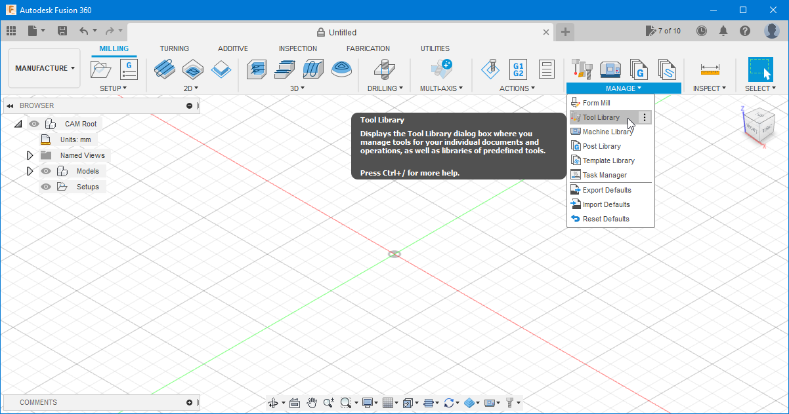
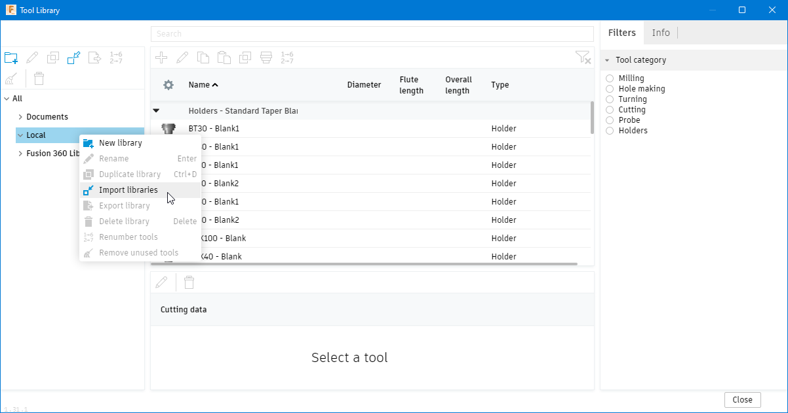

# Tool Library  

Here you can find a tool library for the tools that are currently (March/2022) being supplied by Snapmaker for Snapmaker 2.0

Eventually, additional _tool libraries_ may be added.

# How to import a CAM Tool Library in Fusion 360

After downloading a *Tool library* from the ones available, you need to import it into Fusion 360 to be able to use it on your CNC projects.

1. To install a *tool library* in Fusion 360, you need first to change to the *Manufacture* workspace as on the image below.

    

2. Open the *Tool Library* through the icon shown (in the Manage section of the ribbon).

    

3. In the *Tool Library* window, right-click on *Local* and select the *Import libraries* option.

    

4. Select the downloaded *.tools* file with the tool library to be imported from its location on your computer and hit *Open*. This will add the library underneath your *Local* libraries.

    

5. You have now successfully imported the *tool library* into Fusion 360 and the tools are now available for your milling operations.

######

These instructions were written for Fusion 360 version 2.0.12392 (2022, February)
